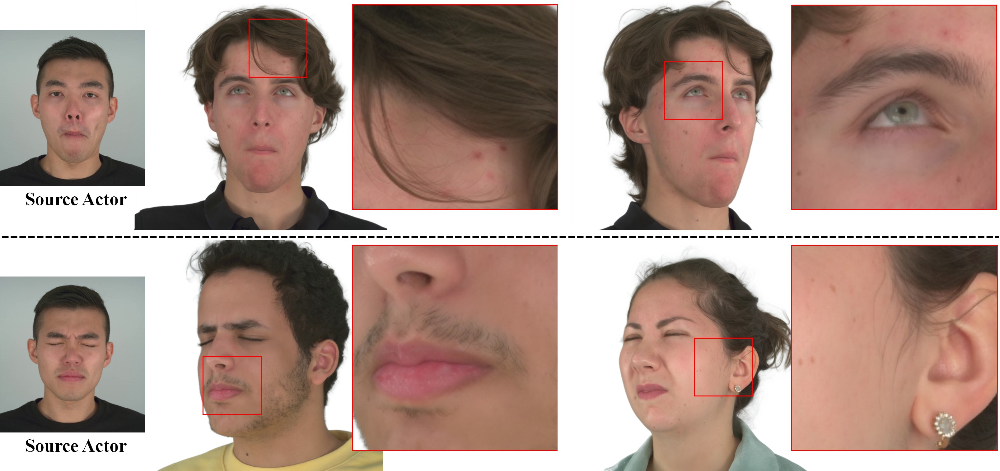
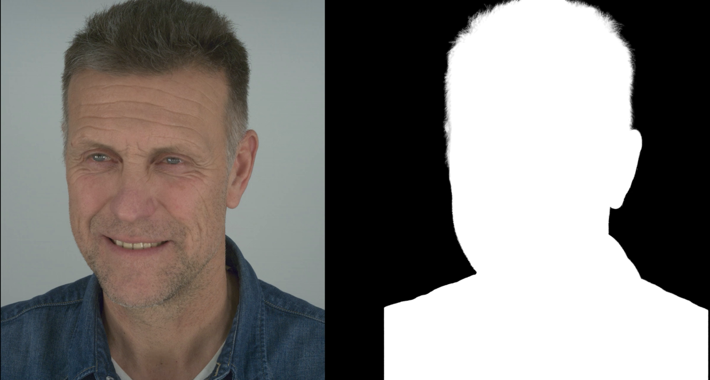
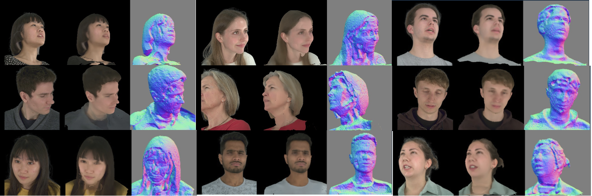
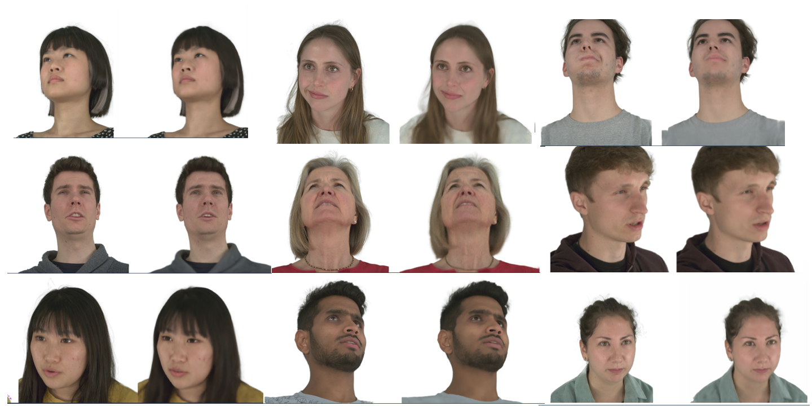

# Preprocessing and Training NeRSemble Dataset on Gaussian Head Avatars

## [Paper](https://arxiv.org/abs/2312.03029) | [Project Page](https://yuelangx.github.io/gaussianheadavatar/)



## Requirements

* Create a conda environment.

```
conda env create -f environment.yaml
conda activate gha
```

* Install [Pytorch3d](https://github.com/facebookresearch/pytorch3d).

```
pip install --no-index --no-cache-dir pytorch3d -f https://dl.fbaipublicfiles.com/pytorch3d/packaging/wheels/py38_cu113_pyt1120/download.html
```

* Install [kaolin](https://github.com/NVIDIAGameWorks/kaolin).

```
pip install kaolin==0.13.0 -f https://nvidia-kaolin.s3.us-east-2.amazonaws.com/torch-1.12.0_cu113.html
```

* Install diff-gaussian-rasterization and simple_knn from [gaussian-splatting](https://github.com/graphdeco-inria/gaussian-splatting). Note, for rendering 32-channel images, please modify "NUM_CHANNELS 3" to "NUM_CHANNELS 32" in "diff-gaussian-rasterization/cuda_rasterizer/config.h".

```
git clone git@github.com:graphdeco-inria/gaussian-splatting.git --recursive
cd gaussian-splatting
# Modify "submodules/diff-gaussian-rasterization/cuda_rasterizer/config.h"
pip install submodules/diff-gaussian-rasterization
pip install submodules/simple-knn
cd ..
```

* Download Required Files and Checkpoints

```
gdown --folder https://drive.google.com/drive/folders/1o8JeQirndKCpL1fvyhp-GsQeBZjgv22i
mv assets/BFM09_model_info.mat Multiview-3DMM-Fitting/assets/BFM/
mv assets/pytorch_resnet101.pth BackgroundMattingV2/assets/
```

## Overview

The codebase has 6 main components.
* Step 1: Extracting frames from raw videos and resizing, cropping to match input of Gaussian-Head-Avatars.
* Step 2: Sampling Data. Every 10th frame is sampled and used for training.
* Step 3: Performing Background Removal using [BackgroundMattingV2](https://github.com/PeterL1n/BackgroundMattingV2)
* Step 4: Performing Multiview BFM 2D Keypoint Detection + Parameter Fitting
* Step 5: Training - Stage 1: Geometry Guided Initialization
* Step 6: Training - Stage 2: Gaussian Head Avatar Model

In case of disconnections between each steps, there is a *start_stage* flag which resumes training for a capture ID from that specific step/stage.

## Preparing Datasets

In this code's pipeline instructions for preprocessing [NeRSemble dataset](https://tobias-kirschstein.github.io/nersemble/):
Apply to download [NeRSemble dataset](https://tobias-kirschstein.github.io/nersemble/) and unzip it into "path/to/raw_NeRSemble/".
I have provided an *unzip.sh* file which extracts all the zip files in the base directory. To speed up the process, multithreading has been applied.  
After unzipping your "raw_NeRSemble" directory should look something like this:

   ```
    ./NeRSemble_raw/
    ├── camera_params
    │   └── 017
    │   └── 018
    |   └── ...
    ├── sequence_BACKGROUND_part-1
    |   └── 017
    |   └── 018
    |   └── ...
    └── sequence_EMO-1-shout+laugh_part-1
        └── 017
        └── 018
        └── ...
   ```

## Running Preprocessing + Training (Full Pipeline)

First modify the path in this [line](https://github.com/yc4ny/NeRSemble_Preprocess/blob/abe7da8115c08827fa16e898120f0fb06550f4d7/preprocess/preprocess_nersemble.py#L114) of the *preprocess/preprocess_nersemble.py* file to the path of your raw nersemble dataset that you have extracted in the previous section.

```
    DATA_SOURCE = '/path/to/raw/nersemble/dataset'
```

Next you can start the full preprocessing and training pipeline with:

```
    python run_full.py --gpu {gpu id} --id {sequence id} --start_stage {step to start from}
```

For example if you have already extracted the frames, cropped and resized on raw videos of sequence ID 018 and want to perform from background removal on GPU ID 0, you should run:

```
    python run_full.py --gpu 0 --id 018 --start_stage 3
```

## Pipeline Outputs in Between 

### Step 3: Background Matting




### Step 4: Multiview BFM Fitting(1) - Landmark Detection


### Step 4: Multiview BFM Fitting(2) - BFM Parameter Fitting


### Step 5: Geometry Guidance Model Training


From Left: GT, Trained Initial, Surface Normal Estimate

### Step 6: Gaussian Head Model Training


Left: GT, Right: Trained Avatar

## Citation

```
@inproceedings{xu2023gaussianheadavatar,
  title={Gaussian Head Avatar: Ultra High-fidelity Head Avatar via Dynamic Gaussians},
  author={Xu, Yuelang and Chen, Benwang and Li, Zhe and Zhang, Hongwen and Wang, Lizhen and Zheng, Zerong and Liu, Yebin},
  booktitle={Proceedings of the IEEE/CVF Conference on Computer Vision and Pattern Recognition (CVPR)},
  year={2024}
}

@Article{kerbl3Dgaussians,
      author       = {Kerbl, Bernhard and Kopanas, Georgios and Leimk{\"u}hler, Thomas and Drettakis, George},
      title        = {3D Gaussian Splatting for Real-Time Radiance Field Rendering},
      journal      = {ACM Transactions on Graphics},
      number       = {4},
      volume       = {42},
      month        = {July},
      year         = {2023},
      url          = {https://repo-sam.inria.fr/fungraph/3d-gaussian-splatting/}
}
